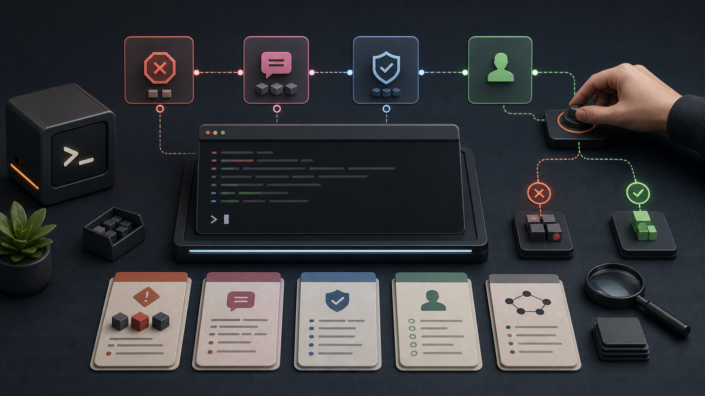
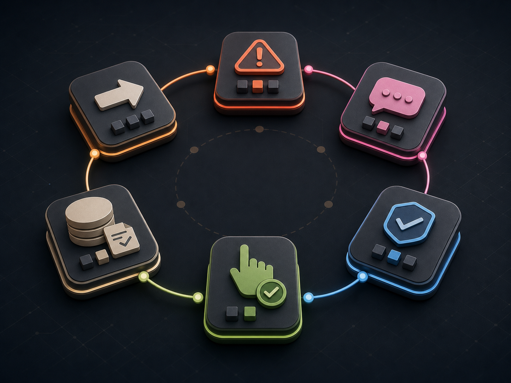

# Skill-Seeking Agent

[](https://github.com/stoicpickle/skillseeking/actions/workflows/tests.yml)




Skill-Seeking Agent is a v1.0 local CLI release for governed capability acquisition. It helps an operator identify capability gaps as structured skill requests, validate temporary Markdown skills, preserve evidence, ask for human decisions, and keep the capability-gap loop inspectable.

It is intentionally **local-only**, **operator-governed**, and **Markdown-first**. Version `1.0.0` is the local CLI compatibility stamp; the matching Git release tag is `v1.0.0`. It is not a production agent framework, not a hosted platform, and not production-safe.

The portfolio version of the project is deliberately narrow: it shows how an agent can stop, explain the missing capability, preserve proof, and ask for the next human decision before new authority is granted.

The product is not a generic skill marketplace or "a chatbot with many tools." The product is the agent's ability to say:

> I am blocked because I lack capability X. I need a skill with input Y, output Z, and success test W.

That capability-gap loop is the core demo, the trust surface, and the long-term product wedge.

## What To Inspect First

| Reviewer question | Start here | Proof |
| --- | --- | --- |
| Does the CLI run from a fresh checkout? | `python3 -m venv .venv && .venv/bin/python -m pip install -e '.[dev]'` | [Start Here](docs/start-here.md) |
| Can it show the capability-gap loop quickly? | `bash scripts/run_launch_demo.sh --keep-workspace` | [Launch demo transcript](docs/launch-demo-transcript.md) |
| Does it compress the next human decision? | `.venv/bin/skill-agent operator-summary --runs-dir <demo-workspace>/runs` | [Operator Summary Review Pack](docs/operator-summary-review-pack.md) |
| Are safety and public-claim boundaries tested? | `bash scripts/v1_smoke.sh` | [V1.0 Release Contract](docs/v1-release-contract.md) |



## Public Repo Framing

Use this repo as a local CLI workbench for governed capability acquisition and skill-request flows. The core hook is:

> An agent that knows when it lacks a skill, requests it, validates it, and continues with an inspectable trace.

The public proof is the CLI demo suite and v1 smoke gate, not a polished hosted product surface. Scripted skills are opt-in trusted-local subprocesses with guardrails; they are **not** a true sandbox.

## Source, Contributions, And Design Partners

This repo is open source under the [MIT License](LICENSE). Contributions are welcome inside the local CLI/dev-preview boundary described in [Contributing](CONTRIBUTING.md).

The current public-preview learning loop is design-partner feedback on local governed capability acquisition, not hosted product onboarding or marketplace launch. Start with the [Operator Summary Review Pack](docs/operator-summary-review-pack.md), then use [Design Partner Feedback](docs/design-partner-feedback.md) and [Governance Monetization Principles](docs/governance-monetization-principles.md) for the strategy boundary.

## Start Here: Skill Gauntlet

The quickest way to see the prototype's behavior is the Skill Gauntlet demo:

```bash
python3 -m venv .venv
.venv/bin/python -m pip install -e '.[dev]'
.venv/bin/python scripts/run_gauntlet_demo.py
```

It runs one mixed-pressure task where the agent:

- loads existing safe skills,
- rejects malicious skill fixtures,
- requests and validates a missing Markdown skill,
- loads that temporary skill only for the run,
- rejects a higher-risk local-code skill and emits a repair request,
- writes a JSON run log with the trace.


To verify the gauntlet as an acceptance test:

```bash
.venv/bin/python -m pytest -q tests/test_gauntlet_demo.py
```

See [Core demo suite](docs/demo-suite.md) for the smaller demos behind each behavior.

## Five-Minute Launch Demo

For the shortest public-dev-preview path through the product wedge, run:

```bash
bash scripts/run_launch_demo.sh --keep-workspace
```

This uses an isolated temporary copy of `skills/` to show the agent detecting a missing capability, requesting and validating a temporary Markdown skill, loading it for one run, then surfacing `candidate-decision` while durable skill admission and stable routing remain disabled. `--keep-workspace` preserves the demo evidence and prints the exact `operator-summary` command to inspect next. See [Start Here](docs/start-here.md) for the short public-preview path and [Launch demo transcript](docs/launch-demo-transcript.md) for the expected landmarks.

## V1.0 Local CLI Release

V1.0 is a stable **local CLI** product for governed skill acquisition. It is not a hosted service, marketplace, production-safe framework, or true sandbox.

Release artifacts:

- [V1.0 Release Tasking](docs/v1-release-tasking.md)
- [V1.0 Release Contract](docs/v1-release-contract.md)
- [V1.0 Release Notes](docs/v1-release-notes.md)
- [Changelog](CHANGELOG.md)

To run the current local v1 smoke path after installing the repo:

```bash
bash scripts/v1_smoke.sh
```

This smoke checks local operator readiness only, including the named `evals/v1_release.jsonl` gate, v1 release documentation, and `skill-agent v1-local-use` managed-prefix checklist. It does not publish releases, admit durable skills, or enable stable routing.

For a faster CLI surface check before a live candidate:

```bash
.venv/bin/python scripts/cli_doctor.py
.venv/bin/python scripts/cli_doctor.py --json
```

The doctor runs representative human and JSON CLI commands in a temporary workspace, then reports any command, parsing, or boundary issues without mutating durable `skills/`.

Run the local security gate before public-facing changes:

```bash
.venv/bin/python scripts/security_check.py
```

The security gate runs Bandit, pip-audit, and detect-secrets against tracked and untracked local source files. It does not install candidate dependencies or add hosted/API behavior.

Scripted skills are trusted-local only. Do not run untrusted scripted skills; `--scripted-skills` does not provide a sandbox.

## V1.0 Ability Breakdown

V1.0 can:

- run local CLI tasks and write schema-versioned JSON run logs;
- explain run logs with `skill-agent explain`;
- load trusted local Markdown skills from the durable registry;
- reject malformed, unsafe, or malicious skill fixtures;
- emit structured skill requests when a capability is missing;
- validate temporary Markdown skills and load them for one run;
- preserve candidate evidence in local ledgers;
- surface human decision requests and append-only resolutions;
- summarize candidate review state with `skill-agent candidate-decision`;
- provide deeper read-only proof reports for usefulness, receipts, readiness, negative evidence, checkpoints, and evidence-governor recommendations;
- support a human-approved managed-prefix local-use lane through `shadow-managed-write`;
- run release, lifecycle, diagnostic, and capability-gap eval suites.

V1.0 still does not provide hosted operation, a marketplace, true sandboxing, dependency installation, durable `skills/` admission for generated candidates, positive stable routing, autonomous promotion, permission widening without review, or active governor steering.

## Current Documentation

- [Product brief](docs/product-brief.md)
- [Start here](docs/start-here.md)
- [General public readiness tasking](docs/general-public-readiness-tasking-2026-06-07.md)
- [System architecture](docs/architecture.md)
- [Skill lifecycle](docs/skill-lifecycle.md)
- [MVP plan](docs/mvp-plan.md)
- [v0 build guardrails](docs/v0-build-guardrails.md)
- [Build map](docs/build-map.md)
- [Core demo suite](docs/demo-suite.md)
- [Data contracts](docs/contracts/data-contracts.md)
- [Evaluation plan](docs/evaluation-plan.md)
- [Safety model](docs/safety-model.md)
- [Roadmap](docs/roadmap.md)
- [Operator summary review pack](docs/operator-summary-review-pack.md)
- [Design partner feedback](docs/design-partner-feedback.md)
- [Design partner feedback log](docs/design-partner-feedback-log.md)
- [Governance monetization principles](docs/governance-monetization-principles.md)
- [V1.0 release tasking](docs/v1-release-tasking.md)
- [V1.0 release contract](docs/v1-release-contract.md)
- [V1.0 release notes](docs/v1-release-notes.md)
- [Changelog](CHANGELOG.md)
- [Stable routing policy](docs/stable-routing-policy.md)
- [Dev log](docs/dev-log.md)
- [Clarifying questions](docs/clarifying-questions.md)
- [References](docs/reference/references.md)
- [ADR 0001: Markdown-only MVP](docs/adr/0001-markdown-only-mvp.md)

## North Star

Build an agent that becomes more capable by maintaining a validated library of reusable skills while staying transparent about what it can and cannot do.

The mature system should:

- Plan tasks in terms of required capabilities.
- Check current skills before executing.
- Produce structured skill requests when blocked.
- Retrieve, draft, validate, and provisionally load skills.
- Log outcomes and maintain the skill library over time.
- Keep unsafe or unvalidated capabilities out of the execution path.

## MVP Boundary

Start with research workflows and Markdown-only skills.

Initial capabilities:

- Search sources.
- Extract claims.
- Score source quality.
- Detect contradictions.
- Build evidence tables.
- Write cited summaries.

The first public demo should show:

```text
BLOCKED -> REQUESTED SKILL -> VALIDATED -> LOADED -> CONTINUED
```

That trace is more important than the final answer. The hook is visible capability self-awareness.

## Implementation Bias

Keep the prototype boring and inspectable:

- Python CLI first.
- Local filesystem skill library using Agent Skills-style folders with `SKILL.md`.
- Pydantic models for contracts and JSON run logs.
- Deterministic planning/routing before embeddings or learned retrieval.
- Pytest-backed validation for explicitly enabled scripted skills.
- Generated temporary skills stay Markdown-only and run-scoped by default.
- Scripted skills remain opt-in trusted-local subprocesses, not a real sandbox.

## Local Setup And Demos

Set up the local environment:

```bash
python3 -m venv .venv
.venv/bin/python -m pip install -e '.[dev]'
```

List local skills:

```bash
.venv/bin/skill-agent registry
```

Run the M1 existing-skill demo:

```bash
.venv/bin/skill-agent run "Extract claims from this article and write a structured summary with source-quality notes."
```

Run the M2 blocked-only skill request demo:

```bash
.venv/bin/skill-agent run "Extract claims from these two sources and identify contradictions." --no-temporary-skills
```

Run the M3 temporary Markdown skill demo:

```bash
.venv/bin/skill-agent run "Cluster arguments from these sources."
```

Generated temporary skills are written under `runs/artifacts/<run_id>/skills` and are not promoted into the durable `skills/` library by default.

Run the M7 canonical v0 trace demo:

```bash
.venv/bin/skill-agent run "Cluster arguments from these sources."
```

Expected landmarks: `PLANNING`, `CHECKING_SKILLS`, `BLOCKED_MISSING_SKILL`, `REQUESTING_SKILL`, `VALIDATION_PASSED`, `LOADING_TEMP_SKILL`, `ROUTE_COMPLETE`, and `RESULT`.

Run the M8 core demo suite with an isolated skills copy — this is the best public smoke test:

```bash
DEMO_DIR=$(mktemp -d)
cp -R skills "$DEMO_DIR/skills"
RUNS_DIR="$DEMO_DIR/runs"

.venv/bin/skill-agent run "Extract claims from this article and write a structured summary with source-quality notes." --skills-dir "$DEMO_DIR/skills" --runs-dir "$RUNS_DIR"
.venv/bin/skill-agent run "Cluster arguments from these sources." --skills-dir "$DEMO_DIR/skills" --runs-dir "$RUNS_DIR"
.venv/bin/skill-agent run "Extract claims from these two sources and identify contradictions." --no-temporary-skills --skills-dir "$DEMO_DIR/skills" --runs-dir "$RUNS_DIR"
.venv/bin/skill-agent registry --skills-dir tests/fixtures/malicious-skills
```

See [Core demo suite](docs/demo-suite.md) for expected statuses and output landmarks.

Run the repair-request demo:

```bash
.venv/bin/skill-agent run "Run local Python analysis on this text."
```

Expected landmarks: `VALIDATION_FAILED`, `REQUESTING_REPAIR`, and `REPAIR_REQUESTED`. This demo is intentionally medium-risk because it asks for local code analysis; contradiction detection itself is safety-low, even if it is medium complexity.

Run the M4 scripted-skill demo:

Do not run untrusted scripted skills. `--scripted-skills` is trusted-local only and does not provide a sandbox.

```bash
.venv/bin/skill-agent run "Count words in one two three." --scripted-skills --no-temporary-skills --skills-dir tests/fixtures/scripted-skills
```

Inspect machine-readable surfaces:

```bash
.venv/bin/skill-agent run "Cluster arguments from these sources." --json
.venv/bin/skill-agent registry --json
.venv/bin/skill-agent health --json
.venv/bin/skill-agent candidates --json
```

Print the compact human-facing CLI banner:

```bash
.venv/bin/skill-agent banner
.venv/bin/skill-agent banner --no-color
```

Run the M5 library health report:

```bash
.venv/bin/skill-agent health
.venv/bin/skill-agent health --json
```

Inspect Skill Candidate Ledger evidence after missing-skill or temporary-skill runs:

```bash
.venv/bin/skill-agent candidates
.venv/bin/skill-agent candidates --json
.venv/bin/skill-agent candidate-usefulness candidate_<id> --runs-dir runs --skills-dir skills
.venv/bin/skill-agent new-authority-readiness
.venv/bin/skill-agent new-authority-readiness --json
.venv/bin/skill-agent feedback-session-template
.venv/bin/skill-agent feedback-session-template --json
.venv/bin/skill-agent feedback-session-append --feedback-log docs/design-partner-feedback-log.md --partner-alias <alias> --date <YYYY-MM-DD> --dry-run
.venv/bin/skill-agent feedback-log-summary --feedback-log docs/design-partner-feedback-log.md
.venv/bin/skill-agent candidate-usefulness candidate_<id> --runs-dir runs --skills-dir skills --json
.venv/bin/skill-agent candidate-usefulness candidate_<id> --runs-dir runs --skills-dir skills --baseline-run-id <run_id> --treatment-run-id <run_id>
.venv/bin/skill-agent skill-receipt candidate_<id> --runs-dir runs --skills-dir skills --baseline-run-id <run_id> --treatment-run-id <run_id>
.venv/bin/skill-agent operator-summary --runs-dir runs
.venv/bin/skill-agent operator-summary --runs-dir runs --json
.venv/bin/skill-agent negative-evidence --runs-dir runs
.venv/bin/skill-agent negative-evidence --runs-dir runs --candidate-id candidate_<id>
.venv/bin/skill-agent evidence-checkpoint --runs-dir runs
.venv/bin/skill-agent evidence-checkpoint --runs-dir runs --no-dry-run
.venv/bin/skill-agent evidence-checkpoint --runs-dir runs --verify
.venv/bin/skill-agent evidence-governor candidate_<id> --runs-dir runs --skills-dir skills
.venv/bin/skill-agent shadow-activation-plan candidate_<id> --runs-dir runs --skills-dir skills
.venv/bin/skill-agent shadow-activation-plan candidate_<id> --runs-dir runs --skills-dir skills --managed-prefix runs/managed_shadow
.venv/bin/skill-agent shadow-rollback-plan candidate_<id> --runs-dir runs --skills-dir skills
.venv/bin/skill-agent shadow-rollback-plan candidate_<id> --runs-dir runs --skills-dir skills --managed-prefix runs/managed_shadow
.venv/bin/skill-agent shadow-activation-acceptance candidate_<id> --runs-dir runs --skills-dir skills --managed-prefix runs/managed_shadow
.venv/bin/skill-agent shadow-activation-acceptance candidate_<id> --runs-dir runs --skills-dir skills --managed-prefix runs/managed_shadow --prepare-acceptance-evidence
.venv/bin/skill-agent shadow-write-gate candidate_<id> --runs-dir runs --skills-dir skills --managed-prefix runs/managed_shadow --acceptance-plan-digest <digest>
.venv/bin/skill-agent promote-candidate candidate_<id> --reviewer "Your Name" --notes "Reviewed temporary evidence"
.venv/bin/skill-agent admission-plan candidate_<id> --runs-dir runs --skills-dir skills
.venv/bin/skill-agent admit-candidate candidate_<id> --runs-dir runs --skills-dir skills --dry-run
.venv/bin/skill-agent admit-candidate candidate_<id> --runs-dir runs --skills-dir skills --dry-run --collision-policy allow_replace_with_approval
.venv/bin/skill-agent admit-candidate candidate_<id> --runs-dir runs --skills-dir skills --dry-run --prepare-write-evidence --expected-source-sha256 <sha256>
```

Candidate entries are evidence for human review only. Auto-promotion is disabled, and `Promotion approval required` refers to durable skill promotion, not current-run execution. `promote-candidate` records human approval and moves an eligible ledger entry to `candidate` status; it does not copy or install a durable skill.

`candidate-usefulness` is a read-only packet for one candidate. It summarizes matching run-log evidence, whether a temporary skill validated and loaded successfully, whether preserved evidence supports usefulness, and whether an admission plan is currently ready. Optional `--baseline-run-id` and `--treatment-run-id` flags compare a pinned no-temporary-skill control run against a pinned temporary-skill treatment run. A valid pair is evidence for that pair only; it does not compute statistical lift or approve durable admission. It does not mutate run logs, candidate ledgers, durable skills, registries, snapshots, staging folders, permissions, or governor behavior.

`skill-receipt` is a read-only proof bundle for one candidate. It aggregates candidate usefulness and durable admission preview evidence into origin, utility, containment, compatibility, approval, and reversibility proof categories. It is an audit surface only: blocked or partial categories show what is still missing before durable admission can even be considered, and no durable copy/install write mode exists yet.

`negative-evidence` is a read-only report over preserved unfavorable or limiting evidence. It surfaces rejected, deferred, blocked, and repair-class input request resolutions plus blocked, quarantined, duplicate, or repair-required candidate ledger evidence. It does not rewrite history; it exists so failed or denied evidence stays visible instead of becoming survivor bias.

`operator-summary` is a read-only operator index over local evidence. It consolidates active input requests, candidate review queues, promotion-ready candidates, missing-evidence signals, unsafe or negative evidence, and changes since the latest evidence checkpoint. Its `OPERATOR_DECISIONS` section is the recommended first inspection surface for design partners because it groups the next operator decision before the raw evidence sections. It is advisory only: it does not approve, promote, install, route, append checkpoints, mutate ledgers, mutate durable skills, mutate registries, or steer the governor.

`new-authority-readiness` is a read-only phase report for the next product boundary. It says the agent is ready for new-authority design review and planning, but not ready to enable new authority. The report names the smallest next authority candidate, the evidence still required before enablement, and the authorities that must remain disabled until a separate reviewed slice exists.

`feedback-session-template` is a template-only helper for design-partner sessions. It prints the canonical session block for manual capture in `docs/design-partner-feedback-log.md`, and its JSON output reports that no feedback log append, rollup update, durable admission, stable routing, permission widening, dependency install, hosted behavior, marketplace behavior, or governor steering occurred.

`feedback-session-append` previews or records one completed design-partner session in a feedback log. It defaults to `--dry-run`; `--no-dry-run` appends only to the selected feedback log and updates objective session/yes-no rollup counters. It does not update repeated-friction synthesis rows, mutate run logs or ledgers, admit durable skills, enable stable routing, widen permissions, install dependencies, enable hosted or marketplace behavior, or steer the governor.

`feedback-log-summary` is a read-only synthesis readiness report for the design-partner feedback log. It reports completed sessions, session-heading consistency, whether 3 to 5 sessions are ready for manual synthesis, and the next evidence action. It never updates the feedback log or enables new authority.

`evidence-checkpoint` creates or verifies a local hash-chain over core evidence files under `runs/`, excluding eval reports and the checkpoint ledger itself. Dry-run mode computes the next checkpoint without writing. `--no-dry-run` appends one record to `runs/evidence_checkpoints.json`; `--verify` checks the checkpoint chain and whether current evidence still matches the latest checkpoint. It is tamper-evidence only: it does not sign evidence, prove trust, approve durable admission, mutate run logs, mutate candidate or resolution ledgers, copy/install durable skills, or steer the governor.

`evidence-governor` is a read-only advisory report for one candidate. It composes the skill receipt, negative evidence, and checkpoint verification surfaces, then recommends only `ask`, `test_more`, `deny`, or `defer`. It never grants approval, authorizes install/copy, promotes candidates, widens permissions, changes routing, mutates ledgers, or enables active governor steering.

`shadow-activation-plan` is a read-only plan for a future managed-prefix activation. It names the content-addressed store path, profile generation, activation pointer, previous generation, rollback target, and shadow plan digest that a later write-mode slice would have to honor. It does not create the managed prefix, switch profiles, copy durable skills, or mutate any ledger.

`shadow-rollback-plan` is a read-only verifier for future managed-prefix rollback. It inspects an existing managed profile pointer and generation directories, reports the current generation, planned next generation, rollback generation, rollback target, and rollback plan digest, and blocks when no previous generation or matching activation pointer can be verified. It does not create generation directories, switch profiles, write store objects, copy durable skills, or mutate any ledger.

`shadow-activation-acceptance` is a controlled acceptance harness for future managed-prefix write mode. By default it reports the run-scoped acceptance paths. With `--prepare-acceptance-evidence`, it writes only under `runs/shadow_activation_acceptance/` or another `--acceptance-prefix` inside `--runs-dir`, copies the source skill into an acceptance store/generation, simulates activation pointer switching, restores the pointer to the rollback generation, and reports activation/rollback verification. It can recover an acceptance pointer already left on the planned generation, and it blocks rather than overwriting conflicting acceptance files or unexpected pointer targets. It refuses acceptance prefixes outside `runs/` and still does not mutate durable `skills/`, the real managed prefix, ledgers, registry, permissions, or governor behavior.

`shadow-write-gate` is a read-only verifier for the future human-approved managed-prefix write boundary. It composes the durable admission preview, shadow activation plan, rollback plan, and prepared acceptance evidence, then verifies the unchanged source hash, acceptance store copy, acceptance generation copy, restored rollback pointer, rollback marker, and supplied exact `--acceptance-plan-digest`. Without that expected digest it remains an inspection-only blocked report. It does not prepare acceptance evidence, switch the real managed prefix, copy/install durable skills, mutate ledgers, widen permissions, or steer the governor.

`skill-agent candidates` and `skill-agent health` also derive advisory review queues from the ledger:

- `promotion_ready`
- `repair_needed`
- `blocked_or_quarantined`
- `duplicate_merge_needed`
- `repeated_requested_gap`

These queues are review aids only. They do not steer routing, promote skills, widen permissions, or change governor decisions.

`admission-plan` is also a dry run. It inspects ledger evidence, run logs, source temporary `SKILL.md` artifacts, and durable registry collisions to decide whether a candidate is ready for human durable admission review. It does not copy, install, promote, or mutate anything.

`admit-candidate --dry-run` previews the future durable admission mutation contract. It reports a nested write plan with the selected source artifact, source SHA-256 fingerprint, exact plan digest, target durable `skills/<name>/SKILL.md` path, future source snapshot path, destination staging path, collision policy, permission policy, permission/dependency diff, missing human review records, blockers, and mutation flags. `--collision-policy block_existing` is the default; `--collision-policy allow_replace_with_approval` can preview a same-name replacement only when append-only human review evidence exists. `--permission-approval-id <resolution-id>` can name separate permission approval evidence for the dry-run write plan. `--plan-approval-id <resolution-id>` can pin the resolved approval whose notes include `plan_digest=<digest>` and `expires_at=<timestamp>`. `--prepare-write-evidence` retains a matching source snapshot and staged destination copy under `runs/` only after the exact dry-run plan is approved and otherwise unblocked; `--expected-source-sha256 <sha256>` blocks that preparation if the source changed. `--no-dry-run` is intentionally rejected; no durable copy/install write mode exists yet.

Run the M6 malicious-skill rejection demo:

```bash
mkdir -p /tmp/skillseeking-empty-runs
.venv/bin/skill-agent registry --skills-dir tests/fixtures/malicious-skills
.venv/bin/skill-agent health --skills-dir tests/fixtures/malicious-skills --runs-dir /tmp/skillseeking-empty-runs
```

Run the capability-gap eval smoke suite:

```bash
.venv/bin/skill-agent eval --suite evals/capgap_smoke.jsonl --skills-dir skills --runs-dir runs/evals
```

Run the broader agent diagnostic suite when deciding what to improve next:

```bash
.venv/bin/skill-agent eval --suite evals/agent_diagnostic_v0.jsonl --skills-dir skills --runs-dir runs/evals
```

The eval writes a machine-readable JSON report and a Markdown summary. It scores task outcome, missing-skill detection, wrong skill loads, unsafe allowance, safe blocking, trace completeness, deterministic skill-request quality, governor assertions, lifecycle candidate evidence, stable-readiness evidence, input-needed requests, and diagnostic dimensions grouped by task tags. The lifecycle smoke suite lives at `evals/skill_lifecycle_v0.jsonl` and covers repeated gaps, temporary success, repair-required failure, advisory review queue expectations, stable-readiness not-routed assertions, and input-focus expectations.

Inspect read-only human-input queues with:

```bash
.venv/bin/skill-agent input-requests --runs-dir runs
```

This normalizes safety approvals, repair reviews, candidate promotion approvals, duplicate/ambiguity decisions, and durable admission review blockers without mutating durable skills.
Use `--json` when you need source diagnostics; the JSON output includes `input_request_items` with run-log or candidate-ledger provenance.

Classify a proposed human decision without mutating evidence:

```bash
.venv/bin/skill-agent resolve-input-request <input-request-id> --runs-dir runs --decision defer --reviewer "Ada" --notes "Reviewed evidence." --dry-run
```

Append human resolution evidence without mutating source run logs or candidate ledgers:

```bash
.venv/bin/skill-agent resolve-input-request <input-request-id> --runs-dir runs --decision approve_workflow --reviewer "Ada" --notes "Reviewed evidence." --no-dry-run
```

Local testing/iteration readiness for the current CLI prototype is proven with:

```bash
.venv/bin/python -m pytest -q
.venv/bin/python scripts/security_check.py
.venv/bin/python -m compileall -q app scripts
.venv/bin/skill-agent eval --suite evals/capgap_smoke.jsonl --skills-dir skills --runs-dir runs/evals
.venv/bin/skill-agent eval --suite evals/capgap_v0.jsonl --skills-dir skills --runs-dir runs/evals
.venv/bin/skill-agent eval --suite evals/skill_lifecycle_v0.jsonl --skills-dir skills --runs-dir runs/evals
.venv/bin/skill-agent eval --suite evals/agent_diagnostic_v0.jsonl --skills-dir skills --runs-dir runs/evals
```

This proves the current prototype surface is ready to test and iterate locally. It does not claim production readiness, real sandboxing, durable candidate installation, stable promotion, or active governor steering.

Explain any run log as a human-readable trace:

```bash
.venv/bin/skill-agent explain runs/run_<timestamp>_<run_id>.json
.venv/bin/skill-agent explain runs/run_<timestamp>_<run_id>.json --include-candidates
```

The explainer summarizes the task, planned capabilities, skills considered, skills loaded or rejected, missing-skill requests, safety stops, trace stages, and optionally matching candidate-ledger evidence.

Run tests:

```bash
.venv/bin/python -m pytest -q
```

Before sharing publicly, check generated/local artifacts are not staged:

```bash
git status --short
find runs -type f ! -name .gitkeep
```

Generated run logs, run-scoped skill artifacts, prompt exports, virtualenvs, caches, and `.env` files should stay local.

Run the M10 acceptance harness:

```bash
.venv/bin/python -m pytest -q tests/test_v0_acceptance.py
```

Run the Skill Gauntlet showcase:

```bash
.venv/bin/python scripts/run_gauntlet_demo.py
.venv/bin/python -m pytest -q tests/test_gauntlet_demo.py
```
