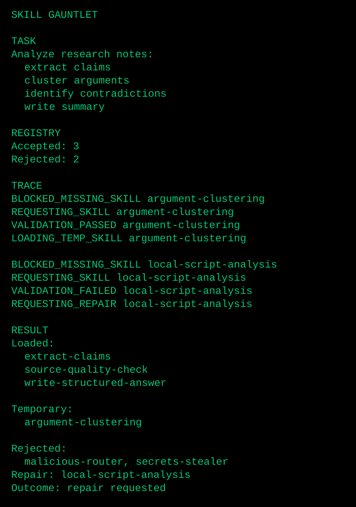

# Skill-Seeking Agent

Skill-Seeking Agent is a CLI-first research prototype exploring agents that can identify capability gaps as structured skill requests, validate temporary Markdown skills, and emit a visible trace of the capability-gap loop.

It is intentionally **experimental**, **local-only**, and **Markdown-first**. It is not a production agent framework, not a hosted platform, and not production-safe.

The product is not a generic skill marketplace or "a chatbot with many tools." The product is the agent's ability to say:

> I am blocked because I lack capability X. I need a skill with input Y, output Z, and success test W.

That capability-gap loop is the core demo, the trust surface, and the long-term product wedge.

## Public Repo Framing

Use this repo as a research playground for capability-gap agents and skill-request flows. The core hook is:

> An agent that knows when it lacks a skill, requests it, validates it, and continues with an inspectable trace.

The public proof is the CLI demo suite, not a polished product surface. Scripted skills are opt-in trusted-local subprocesses with guardrails; they are **not** a true sandbox yet.

## Start Here: Skill Gauntlet

The quickest way to see the prototype's behavior is the Skill Gauntlet demo:

```bash
python3 -m venv .venv
.venv/bin/python -m pip install -e '.[dev]'
.venv/bin/python scripts/run_gauntlet_demo.py
```

It runs one mixed-pressure task where the agent:

- loads existing safe skills,
- rejects malicious skill fixtures,
- requests and validates a missing Markdown skill,
- loads that temporary skill only for the run,
- rejects a higher-risk local-code skill and emits a repair request,
- writes a JSON run log with the trace.



To verify the gauntlet as an acceptance test:

```bash
.venv/bin/python -m pytest -q tests/test_gauntlet_demo.py
```

See [Core demo suite](docs/demo-suite.md) for the smaller demos behind each behavior.

## Current Documentation

- [Product brief](docs/product-brief.md)
- [System architecture](docs/architecture.md)
- [Skill lifecycle](docs/skill-lifecycle.md)
- [MVP plan](docs/mvp-plan.md)
- [v0 build guardrails](docs/v0-build-guardrails.md)
- [Build map](docs/build-map.md)
- [Core demo suite](docs/demo-suite.md)
- [Data contracts](docs/contracts/data-contracts.md)
- [Evaluation plan](docs/evaluation-plan.md)
- [Safety model](docs/safety-model.md)
- [Roadmap](docs/roadmap.md)
- [Dev log](docs/dev-log.md)
- [Clarifying questions](docs/clarifying-questions.md)
- [References](docs/reference/references.md)
- [ADR 0001: Markdown-only MVP](docs/adr/0001-markdown-only-mvp.md)

## North Star

Build an agent that becomes more capable by maintaining a validated library of reusable skills while staying transparent about what it can and cannot do.

The mature system should:

- Plan tasks in terms of required capabilities.
- Check current skills before executing.
- Produce structured skill requests when blocked.
- Retrieve, draft, validate, and provisionally load skills.
- Log outcomes and maintain the skill library over time.
- Keep unsafe or unvalidated capabilities out of the execution path.

## MVP Boundary

Start with research workflows and Markdown-only skills.

Initial capabilities:

- Search sources.
- Extract claims.
- Score source quality.
- Detect contradictions.
- Build evidence tables.
- Write cited summaries.

The first public demo should show:

```text
BLOCKED -> REQUESTED SKILL -> VALIDATED -> LOADED -> CONTINUED
```

That trace is more important than the final answer. The hook is visible capability self-awareness.

## Implementation Bias

Keep the prototype boring and inspectable:

- Python CLI first.
- Local filesystem skill library using Agent Skills-style folders with `SKILL.md`.
- Pydantic models for contracts and JSON run logs.
- Deterministic planning/routing before embeddings or learned retrieval.
- Pytest-backed validation for explicitly enabled scripted skills.
- Generated temporary skills stay Markdown-only and run-scoped by default.
- Scripted skills remain opt-in trusted-local subprocesses, not a real sandbox.

## Local Setup And Demos

Set up the local environment:

```bash
python3 -m venv .venv
.venv/bin/python -m pip install -e '.[dev]'
```

List local skills:

```bash
.venv/bin/skill-agent registry
```

Run the M1 existing-skill demo:

```bash
.venv/bin/skill-agent run "Extract claims from this article and write a structured summary with source-quality notes."
```

Run the M2 blocked-only skill request demo:

```bash
.venv/bin/skill-agent run "Extract claims from these two sources and identify contradictions." --no-temporary-skills
```

Run the M3 temporary Markdown skill demo:

```bash
.venv/bin/skill-agent run "Cluster arguments from these sources."
```

Generated temporary skills are written under `runs/artifacts/<run_id>/skills` and are not promoted into the durable `skills/` library by default.

Run the M7 canonical v0 trace demo:

```bash
.venv/bin/skill-agent run "Cluster arguments from these sources."
```

Expected landmarks: `PLANNING`, `CHECKING_SKILLS`, `BLOCKED_MISSING_SKILL`, `REQUESTING_SKILL`, `VALIDATION_PASSED`, `LOADING_TEMP_SKILL`, `ROUTE_COMPLETE`, and `RESULT`.

Run the M8 core demo suite with an isolated skills copy — this is the best public smoke test:

```bash
DEMO_DIR=$(mktemp -d)
cp -R skills "$DEMO_DIR/skills"
RUNS_DIR="$DEMO_DIR/runs"

.venv/bin/skill-agent run "Extract claims from this article and write a structured summary with source-quality notes." --skills-dir "$DEMO_DIR/skills" --runs-dir "$RUNS_DIR"
.venv/bin/skill-agent run "Cluster arguments from these sources." --skills-dir "$DEMO_DIR/skills" --runs-dir "$RUNS_DIR"
.venv/bin/skill-agent run "Extract claims from these two sources and identify contradictions." --no-temporary-skills --skills-dir "$DEMO_DIR/skills" --runs-dir "$RUNS_DIR"
.venv/bin/skill-agent registry --skills-dir tests/fixtures/malicious-skills
```

See [Core demo suite](docs/demo-suite.md) for expected statuses and output landmarks.

Run the repair-request demo:

```bash
.venv/bin/skill-agent run "Run local Python analysis on this text."
```

Expected landmarks: `VALIDATION_FAILED`, `REQUESTING_REPAIR`, and `REPAIR_REQUESTED`. This demo is intentionally medium-risk because it asks for local code analysis; contradiction detection itself is safety-low, even if it is medium complexity.

Run the M4 scripted-skill demo:

```bash
.venv/bin/skill-agent run "Count words in one two three." --scripted-skills --no-temporary-skills --skills-dir tests/fixtures/scripted-skills
```

Inspect machine-readable surfaces:

```bash
.venv/bin/skill-agent run "Cluster arguments from these sources." --json
.venv/bin/skill-agent registry --json
.venv/bin/skill-agent health --json
.venv/bin/skill-agent candidates --json
```

Run the M5 library health report:

```bash
.venv/bin/skill-agent health
.venv/bin/skill-agent health --json
```

Inspect Skill Candidate Ledger evidence after missing-skill or temporary-skill runs:

```bash
.venv/bin/skill-agent candidates
.venv/bin/skill-agent candidates --json
```

Candidate entries are evidence for human review only. Auto-promotion is disabled, and `Promotion approval required` refers to durable skill promotion, not current-run execution.

Run the M6 malicious-skill rejection demo:

```bash
mkdir -p /tmp/skillseeking-empty-runs
.venv/bin/skill-agent registry --skills-dir tests/fixtures/malicious-skills
.venv/bin/skill-agent health --skills-dir tests/fixtures/malicious-skills --runs-dir /tmp/skillseeking-empty-runs
```

Run the capability-gap eval smoke suite:

```bash
.venv/bin/skill-agent eval --suite evals/capgap_smoke.jsonl --skills-dir skills --runs-dir runs/evals
```

The eval writes a machine-readable JSON report and a Markdown summary. It scores task outcome, missing-skill detection, wrong skill loads, unsafe allowance, safe blocking, trace completeness, deterministic skill-request quality, governor assertions, and lifecycle candidate evidence. The lifecycle smoke suite lives at `evals/skill_lifecycle_v0.jsonl`.

Explain any run log as a human-readable trace:

```bash
.venv/bin/skill-agent explain runs/run_<timestamp>_<run_id>.json
.venv/bin/skill-agent explain runs/run_<timestamp>_<run_id>.json --include-candidates
```

The explainer summarizes the task, planned capabilities, skills considered, skills loaded or rejected, missing-skill requests, safety stops, trace stages, and optionally matching candidate-ledger evidence.

Run tests:

```bash
.venv/bin/python -m pytest -q
```

Before sharing publicly, check generated/local artifacts are not staged:

```bash
git status --short
find runs -type f ! -name .gitkeep
```

Generated run logs, run-scoped skill artifacts, prompt exports, virtualenvs, caches, and `.env` files should stay local.

Run the M10 acceptance harness:

```bash
.venv/bin/python -m pytest -q tests/test_v0_acceptance.py
```

Run the Skill Gauntlet showcase:

```bash
.venv/bin/python scripts/run_gauntlet_demo.py
.venv/bin/python -m pytest -q tests/test_gauntlet_demo.py
```
